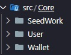
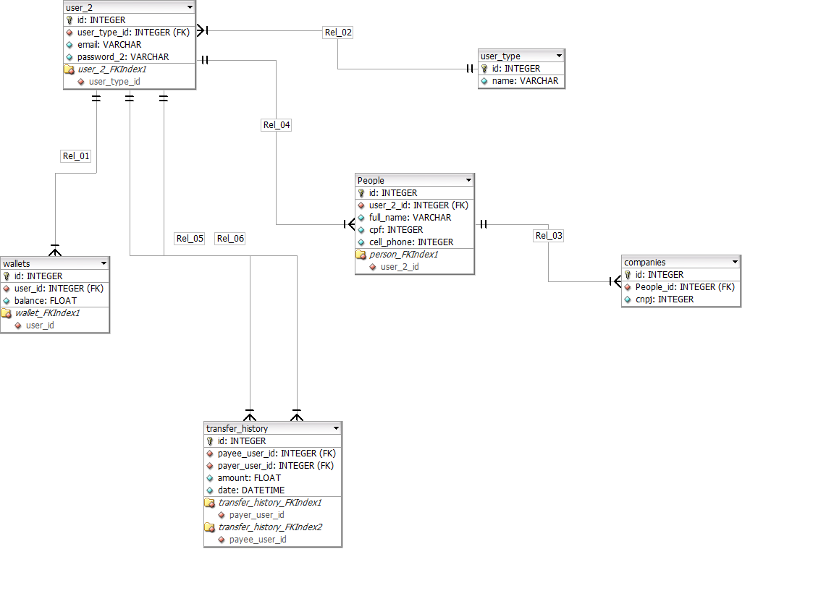

# Pp Simplificado


## Instruções

Baixa o repositorio

```
git clone https://github.com/jorgemarinho/pp-simplificado.git
```

Subir o serviço docker, caso não esteja iniciado

```
service docker start
```


Primeira vez, fazer um build

```
docker-compose up --build 
```

Outras vezes
```
docker-compose up -d
```

Serviço disponivel na porta

```
http://localhost:8000
```

Executando teste
```
composer test
```

Test coverage %
```
composer test:coverage

```

## Arquitetura Clean Architecture ##


**Core da aplicação está na pasta src**




**Modelagem de dados**



